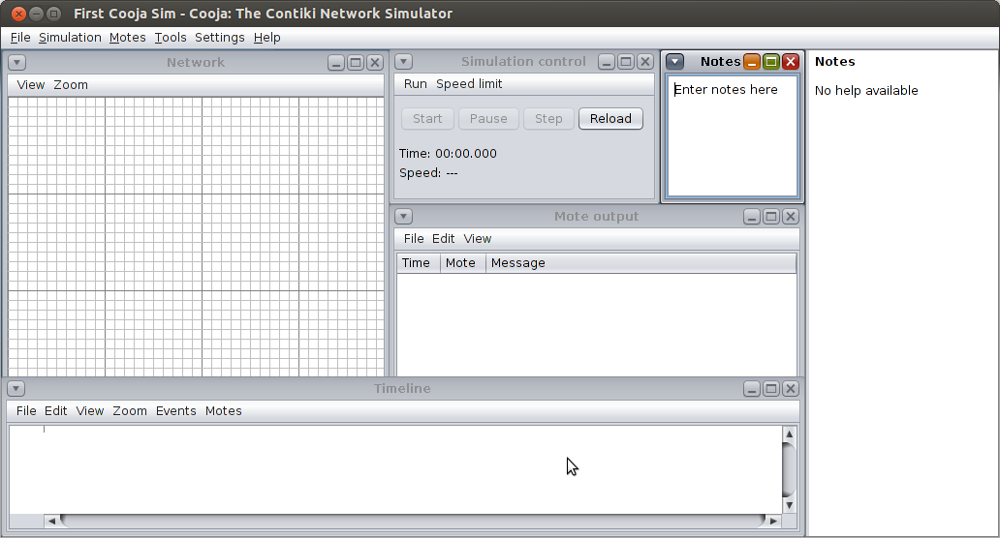

# TinyOS Cooja Simulator
This is a TinyOS application which transfer data between three sensors (motes) and according to the seder ID turn off/on the LEDs. These sensors broadcast messages. When a sensor receive a message, it turns LEDs on and off according to counters that it received. So every time a timer fires it sends a message containing this counter and sensor ID which is declared in “.h” file.
In “RadioCountToLedsC.nc” there are three timers with three different times (Milisec), and the other related interfaces including LED, boot, timer, receiving, sending, starting the radio and managing packets.

In this application there are three files called "RadioCountToLeds.h", "RadioCountToLedsappc.nc" and "RadioCountToLedsC.nc". 
In the header file I define the structure of the message and the message is composed by a SenderId and a counter. 
In "RadioCountToLedsappc.nc" file I connect the interfaces that I define in RadioCountToLedsC.nc" file.
"RadioCountToLedsC.nc" file includes all the program code for used module interfaces and running events that described sequently.

## first section: 
define header files (timer and our stracture header) and all of modules that I used during the project.

## second section:
start to set variables and type of them like locked with type of boolian that I use for locking a message for sending.

## third section:
implement events such as boot, according to our knowledge always I have an initial function in C family program that called at the begining of starting program that this project is boot. so, in boot event I call an AMControl.start() function to start the program.

## forth section:
in AMControl.start I check the function and if no problem I go for periodically calling timers for each mote individually.

## fifth section:
I fire each timer and running counter also id of each motes to produce the packet and ready for send by broadcast with AMSend.send() function and argument AM_BROADCAST_ADDR.

sixth section: I receive the packets by Receive.receive() function and compare for deciding to toggling the leds.

# Result
we can see the leds according to each three motes are turning on.
each mote broadcast a message to other motes and demonestrate on the first picture that the leds related to other motes turn on other motes this means that the broadcast message with other motes received from each of them and turn related led

- the led one with green light related to mote two.
- the led two with red light related to mote one.
- the led three with blue light related to mote three.

# Cooja Simulator
[`cooja`](https://anrg.usc.edu/contiki/index.php/Cooja_Simulator) is a simulator for tinyos that has GUI and you can see a snapshot of it on the below picture.

